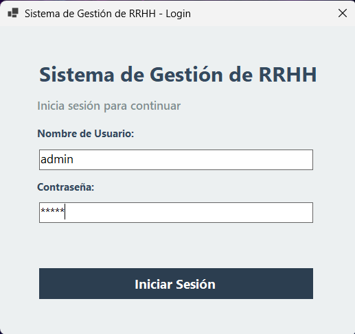
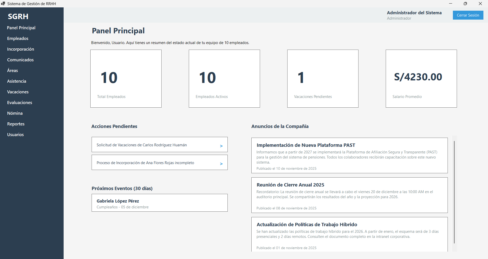
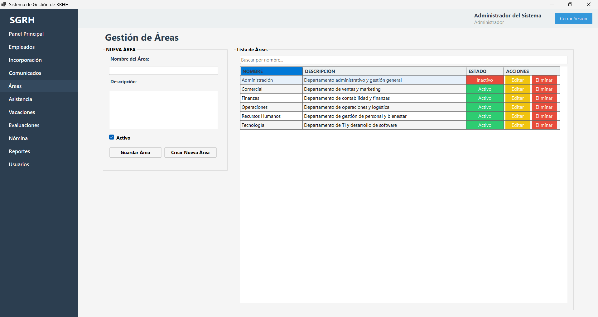
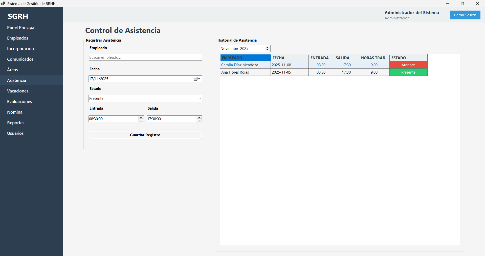
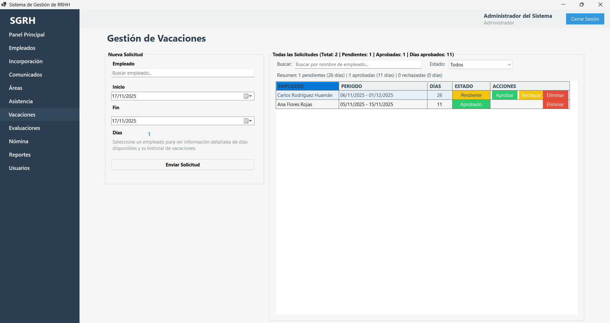
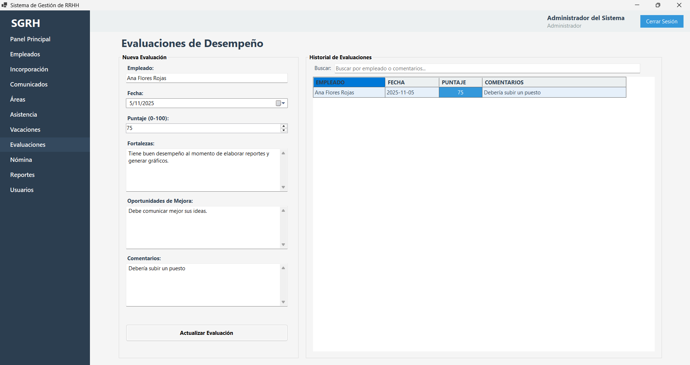
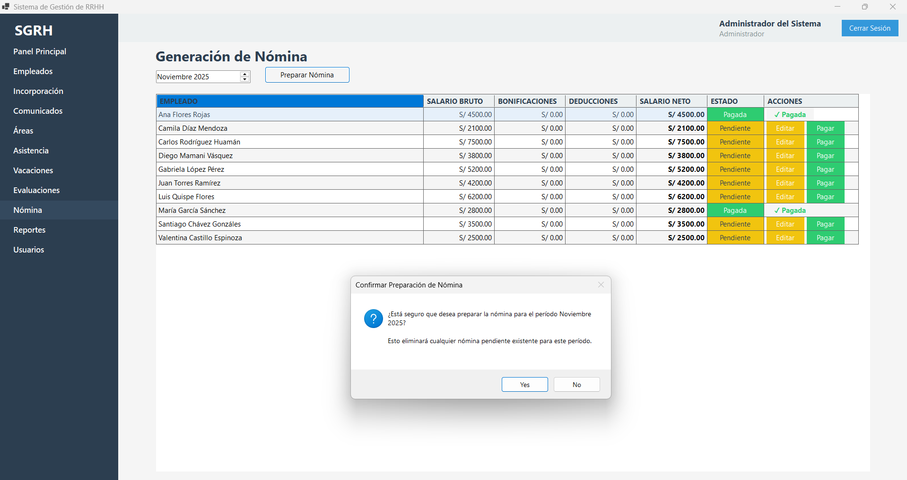
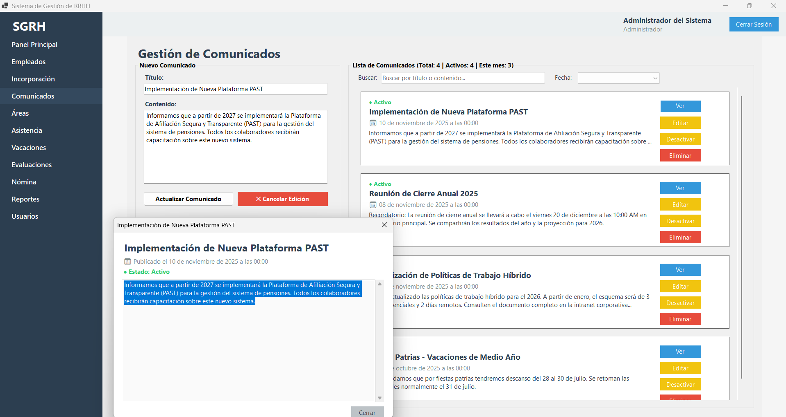
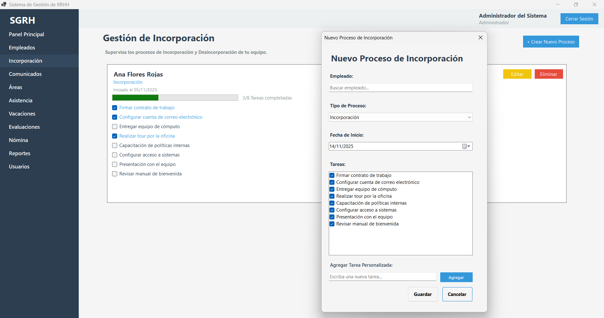
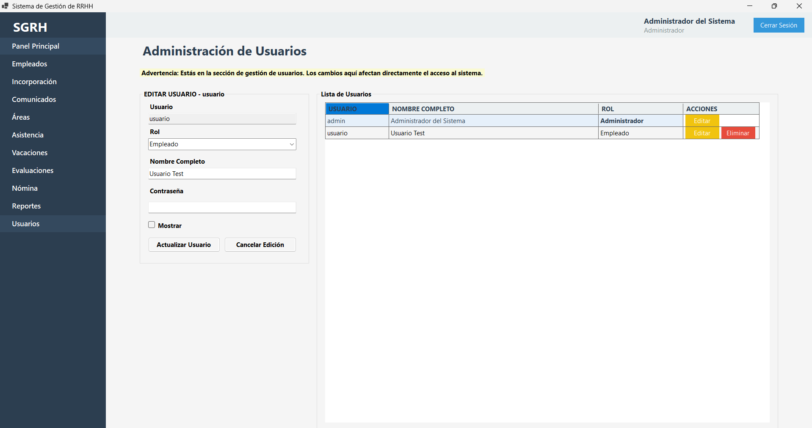

# Manual de Usuario - Sistema de Gestión de Recursos Humanos (SGRH)

## Información del Proyecto

**Universidad**: Universidad Nacional de la Amazonía Peruana  
**Curso**: Lenguaje de Programación III  
**Grupo**: Grupo 1  
**Versión**: 1.0

## Introducción

El Sistema de Gestión de Recursos Humanos (SGRH) es una aplicación de escritorio desarrollada en C# con Windows Forms que permite gestionar la información de empleados, asistencias, vacaciones, evaluaciones, nómina y otros aspectos relacionados con recursos humanos.

Este manual proporciona instrucciones detalladas para utilizar todas las funcionalidades del sistema.

## Requisitos del Sistema

- Windows 10 o superior
- .NET 8.0 Runtime instalado
- SQL Server (LocalDB, Express o versión completa)
- Resolución de pantalla mínima: 1366x768 (recomendada: 1920x1080)

## Inicio de Sesión

Al iniciar la aplicación, se mostrará la pantalla de login. Para acceder al sistema:

1. Ingrese su nombre de usuario en el campo "Usuario"
2. Ingrese su contraseña en el campo "Contraseña"
3. Haga clic en el botón "Iniciar Sesión" o presione Enter

**Credenciales por defecto:**
- Usuario: admin
- Contraseña: admin

Si las credenciales son incorrectas, se mostrará un mensaje de error en rojo. Una vez autenticado correctamente, se abrirá la pantalla principal del sistema.

## Pantalla Principal

La pantalla principal muestra un menú lateral con las siguientes opciones:

- Dashboard
- Empleados
- Áreas
- Asistencia
- Vacaciones
- Evaluaciones
- Nómina
- Reportes
- Comunicados
- Incorporación
- Usuarios (solo para administradores)
- Cerrar Sesión

En la parte superior se muestra el nombre del usuario logueado y su rol. El botón "Cerrar Sesión" se encuentra en la esquina superior derecha.

## Dashboard

El dashboard muestra un resumen general del sistema con los siguientes indicadores:

- Total de empleados
- Empleados activos
- Vacaciones pendientes
- Salario promedio

También muestra los últimos comunicados y procesos de incorporación en curso. Desde el dashboard puedes hacer clic en cualquier elemento para acceder directamente al módulo correspondiente.

## Gestión de Empleados

Para gestionar empleados, seleccione "Empleados" en el menú lateral.

### Agregar un Nuevo Empleado

1. Complete todos los campos del formulario:
   - **DNI**: Debe tener 8 dígitos y ser único en el sistema
   - **Nombre**: Nombre del empleado
   - **Apellido**: Apellido del empleado
   - **Email**: Dirección de correo electrónico (formato válido)
   - **Teléfono**: Número de teléfono (opcional)
   - **Fecha de Nacimiento**: Fecha de nacimiento (opcional)
   - **Dirección**: Dirección del empleado (opcional)
   - **Área**: Seleccione el área de la lista desplegable
   - **Puesto**: Puesto de trabajo
   - **Tipo de Contrato**: Tipo de contrato laboral
   - **Fecha de Contrato**: Fecha de inicio del contrato
   - **Salario Base**: Salario base del empleado (debe ser mayor o igual a 0)
   - **Sistema de Pensión**: Sistema de pensión al que pertenece
   - **Estado**: Estado del empleado

2. Haga clic en "Guardar Empleado"

3. Si hay errores de validación, se mostrarán mensajes en rojo junto a los campos correspondientes

### Editar un Empleado

1. Haga doble clic en la fila del empleado que desea editar en la tabla
2. El formulario se llenará con los datos del empleado
3. Modifique los campos necesarios
4. Haga clic en "Guardar Empleado"

**Nota**: El DNI no se puede modificar al editar un empleado.

### Eliminar un Empleado

1. Seleccione el empleado en la tabla
2. Haga clic en el botón "Eliminar" que aparece en la columna de acciones
3. Confirme la eliminación en el diálogo que aparece

**Nota**: La eliminación es lógica (soft delete), el empleado se marca como inactivo pero no se elimina físicamente de la base de datos.

### Buscar Empleados

Use el campo de búsqueda en la parte superior para buscar empleados por nombre o DNI. La búsqueda se realiza en tiempo real mientras escribe.

## Gestión de Áreas

Para gestionar áreas, seleccione "Áreas" en el menú lateral.

### Agregar un Área

1. Ingrese el nombre del área
2. Ingrese una descripción (opcional)
3. Haga clic en "Guardar Área"

### Editar un Área

1. Haga doble clic en la fila del área que desea editar
2. Modifique los campos necesarios
3. Haga clic en "Guardar Área"

### Eliminar un Área

1. Seleccione el área en la tabla
2. Haga clic en el botón "Eliminar"
3. Confirme la eliminación

**Nota**: No se puede eliminar un área que tenga empleados asignados.

## Control de Asistencia

Para registrar asistencias, seleccione "Asistencia" en el menú lateral.

### Registrar Asistencia

1. Seleccione el empleado escribiendo su nombre en el campo de búsqueda (autocompletado)
2. Seleccione la fecha
3. Ingrese la hora de entrada
4. Ingrese la hora de salida
5. El sistema calculará automáticamente las horas trabajadas
6. Seleccione el estado (Presente, Tarde, Ausente)
7. Haga clic en "Guardar Asistencia"

### Ver Asistencias

La tabla muestra todas las asistencias registradas. Puede filtrar por mes usando el selector de fecha en la parte superior.

### Editar o Eliminar Asistencia

Haga doble clic en una fila para editarla, o use el botón "Eliminar" en la columna de acciones.

## Gestión de Vacaciones

Para gestionar vacaciones, seleccione "Vacaciones" en el menú lateral.

### Solicitar Vacaciones

1. Seleccione el empleado escribiendo su nombre
2. Seleccione la fecha de inicio
3. Seleccione la fecha de fin
4. El sistema calculará automáticamente los días totales
5. Haga clic en "Enviar Solicitud"

La solicitud se creará con estado "Pendiente".

### Aprobar o Rechazar Vacaciones

1. En la tabla de solicitudes, localice la solicitud pendiente
2. Haga clic en el botón "Aprobar" o "Rechazar" según corresponda
3. Confirme la acción en el diálogo

**Nota**: Solo los administradores pueden aprobar o rechazar solicitudes.

### Ver Vacaciones

La tabla muestra todas las solicitudes de vacaciones. Puede filtrar por estado usando los filtros en la parte superior.

## Evaluaciones de Desempeño

Para gestionar evaluaciones, seleccione "Evaluaciones" en el menú lateral.

### Registrar una Evaluación

1. Seleccione el empleado escribiendo su nombre
2. Seleccione la fecha de la evaluación
3. Ingrese el puntaje (0-100)
4. Ingrese las fortalezas (opcional)
5. Ingrese las oportunidades de mejora (opcional)
6. Ingrese comentarios adicionales (opcional)
7. Haga clic en "Guardar Evaluación"

El sistema clasificará automáticamente la evaluación según el puntaje:
- 90-100: Excelente
- 75-89: Bueno
- 60-74: Regular
- 0-59: Deficiente

## Gestión de Nómina

Para gestionar nómina, seleccione "Nómina" en el menú lateral.

### Preparar Nómina

1. Ingrese el período (formato: YYYY-MM, ejemplo: 2024-01)
2. Haga clic en "Preparar Nómina"
3. El sistema generará automáticamente los registros de nómina para todos los empleados activos

### Editar Nómina

1. Haga doble clic en una fila de la tabla
2. Modifique los valores de salario bruto, bonificaciones o deducciones
3. El salario neto se calculará automáticamente
4. Haga clic en "Guardar"

### Marcar como Pagada

1. Seleccione la nómina en la tabla
2. Haga clic en el botón "Marcar como Pagada"
3. Confirme la acción

## Generación de Reportes

Para generar reportes, seleccione "Reportes" en el menú lateral.

### Tipos de Reportes Disponibles

- **Reporte de Empleados**: Lista de empleados activos con todos sus datos
- **Reporte de Asistencia**: Asistencias en un rango de fechas
- **Reporte de Vacaciones**: Solicitudes de vacaciones en un rango de fechas
- **Reporte de Evaluaciones**: Evaluaciones en un rango de fechas
- **Reporte de Nómina**: Nómina de un período específico

### Generar un Reporte

1. Seleccione el tipo de reporte
2. Si el reporte requiere filtros de fecha, se abrirá un diálogo para seleccionar el rango
3. Haga clic en "Generar Reporte"
4. Seleccione la ubicación donde desea guardar el archivo Excel
5. Ingrese el nombre del archivo
6. Haga clic en "Guardar"

El reporte se generará en formato Excel (.xlsx) con formato profesional.

## Comunicados

Para gestionar comunicados, seleccione "Comunicados" en el menú lateral.

### Crear un Comunicado

1. Ingrese el título del comunicado
2. Ingrese el contenido (mínimo 10 caracteres)
3. Haga clic en "Guardar Comunicado"

Los comunicados se mostrarán en el dashboard y en la sección de comunicados.

### Editar o Eliminar Comunicado

Use los botones correspondientes en la tabla para editar o eliminar comunicados.

## Incorporación de Empleados

Para gestionar procesos de incorporación, seleccione "Incorporación" en el menú lateral.

### Crear Proceso de Incorporación

1. Haga clic en "Nueva Incorporación"
2. Seleccione el tipo de proceso (Incorporación o Desincorporación)
3. Seleccione el empleado
4. Seleccione la fecha de inicio
5. El sistema cargará tareas predefinidas según el tipo de proceso
6. Haga clic en "Guardar"

### Completar Tareas

1. En la lista de procesos, localice el proceso deseado
2. Marque las casillas de las tareas completadas
3. Las tareas se guardarán automáticamente

## Gestión de Usuarios

Para gestionar usuarios del sistema, seleccione "Usuarios" en el menú lateral. Esta opción solo está disponible para administradores.

### Agregar un Usuario

1. Ingrese el nombre de usuario (único)
2. Ingrese la contraseña
3. Ingrese el nombre completo
4. Seleccione el rol (Administrador o Empleado)
5. Marque "Activo" si desea que el usuario pueda iniciar sesión
6. Haga clic en "Guardar Usuario"

### Editar un Usuario

1. Haga doble clic en la fila del usuario
2. Modifique los campos necesarios
3. Si no desea cambiar la contraseña, deje el campo vacío
4. Haga clic en "Guardar Usuario"

### Eliminar un Usuario

1. Seleccione el usuario en la tabla
2. Haga clic en "Eliminar"
3. Confirme la eliminación

**Nota**: No se puede eliminar el último usuario activo del sistema.

## Cerrar Sesión

Para cerrar sesión, haga clic en "Cerrar Sesión" en el menú lateral o en el botón de la esquina superior derecha. Esto cerrará la sesión actual y volverá a la pantalla de login.

## Validaciones y Mensajes de Error

El sistema realiza validaciones en tiempo real y muestra mensajes de error en rojo junto a los campos que tienen problemas. Algunas validaciones comunes:

- DNI debe tener 8 dígitos y ser único
- Email debe tener formato válido
- Campos obligatorios no pueden estar vacíos
- Fechas deben ser válidas (fecha fin mayor que fecha inicio)
- Puntajes de evaluación deben estar entre 0 y 100
- Salario base debe ser mayor o igual a 0

## Solución de Problemas

### No puedo iniciar sesión

- Verifique que las credenciales sean correctas
- Asegúrese de que el usuario esté activo
- Verifique que la base de datos esté configurada correctamente

### No se guardan los datos

- Verifique que todos los campos obligatorios estén completos
- Revise los mensajes de error en rojo junto a los campos
- Asegúrese de que no haya duplicados (como DNI)

### Error de conexión a la base de datos

- Verifique que SQL Server esté ejecutándose
- Revise la cadena de conexión en `Data/Access/DatabaseConnection.cs`
- Asegúrese de que la base de datos SGRH exista

### Los reportes no se generan

- Asegúrese de tener permisos de escritura en la carpeta seleccionada
- Verifique que tenga espacio en disco suficiente
- Cierre el archivo Excel si está abierto

### La aplicación se cierra inesperadamente

- Verifique que tenga .NET 8.0 instalado
- Revise los logs de errores si están disponibles
- Asegúrese de que la base de datos esté accesible

